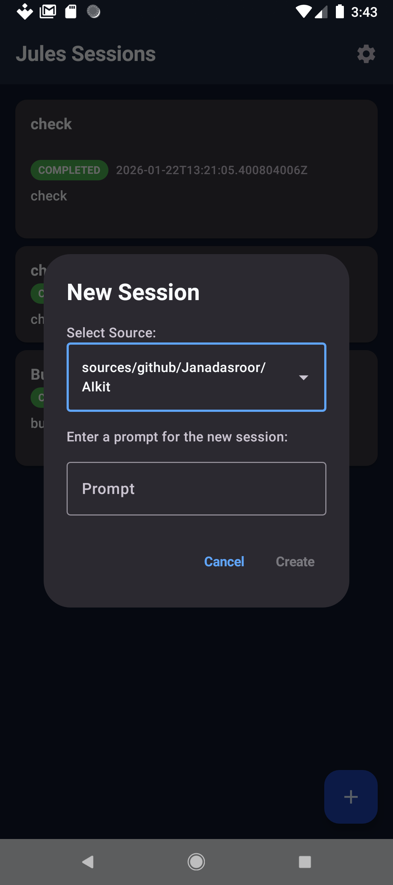

# Jules Android Client

[](https://kotlinlang.org)
[](https://developer.android.com/jetpack/compose)
[]()

> A powerful Android application for interacting with the Google Jules API. seamlessly manage sessions, chat with the Jules agent, and oversee project modifications directly from your mobile device.

---

## ⚠️ Disclaimer

**This is NOT an official Google product.** This application is a community-driven open-source project created by JanadaSroor and is not affiliated with, endorsed by, or sponsored by Google. It interacts with the Google Jules API but is developed independently.

## Overview

**Jules Android Client** allows developers and project managers to interact with the Jules coding agent on the go. This application provides a full-featured interface to control your Jules sessions, review generated plans, and communicate directly with the AI agent to modify your projects.

This project was crafted using **Vibe Coding** methodologies, leveraging advanced AI assistance to rapidly prototype, iterate, and implement robust functionality.

Whether you need to check the status of a task, approve a critical code change, or start a new refactoring session, this app puts the power of Jules in your pocket.

## Features

*   **Session Management**: View a comprehensive list of all active and past sessions.
*   **Create Sessions**: Quickly initialize new sessions with custom prompts and select specific source contexts from your project.
*   **Interactive Chat**: Communicate with the Jules agent in real-time. Send instructions, ask questions, and view the full conversation history.
*   **Plan Approval**: Review and approve execution plans generated by the agent (`AWAITING_PLAN_APPROVAL` state) to proceed with code modifications.
*   **Activity Log**: detailed chronological view of all session activities, including agent responses, system events, and errors.
*   **Source Selection**: Integrated support for selecting project sources/contexts when starting a session.

## Tech Stack

This project is built using modern Android development practices:

*   **Language**: [Kotlin](https://kotlinlang.org/)
*   **UI Framework**: [Jetpack Compose](https://developer.android.com/jetpack/compose) (Material 3)


## Screenshots

| Session List | Chat Interface |
|:---:|:---:|
|  |  |

## Setup & Installation

### Prerequisites
*   Android Studio Ladybug or newer.
*   JDK 11 or higher.
*   **Google Jules API Key**.

### Installation

1.  **Clone the repository:**
    ```bash
    git clone https://github.com/JanadaSroor/Jules2.git
    cd Jules2
    ```

2.  **Install on Device:**
    ```bash
    ./gradlew installDebug
    ```

### Configuration (Important)

To use the app, you need a valid **Jules API Key**.

1.  Go to [jules.google.com/u/2/settings/api](https://jules.google.com/u/2/settings/api).
2.  **Login** with your Google account and **Authorize** with your GitHub account when prompted.
3.  Copy your API Key.
4.  Open the App, go to **Settings**, and paste your API Key.

## Usage

1.  **Start a Session**: Tap the `+` FAB on the home screen. Enter your instruction (e.g., "Refactor the LoginActivity") and select the relevant source file/module.
2.  **Chat**: Tap on any session to enter the detail view. Type messages at the bottom to guide the agent.

## Contributing

Contributions are welcome! Please fork the repository and submit a pull request for any enhancements or bug fixes.

1.  Fork the Project
2.  Create your Feature Branch (`git checkout -b feature/AmazingFeature`)
3.  Commit your Changes (`git commit -m 'Add some AmazingFeature'`)
4.  Push to the Branch (`git push origin feature/AmazingFeature`)
5.  Open a Pull Request

##  References & Resources

The following official documentation links were utilized to understand the Jules API structure and assist the AI in building this client:

*   [Jules API REST Reference](https://developers.google.com/jules/api/reference/rest)
*   [Sessions Resource](https://developers.google.com/jules/api/reference/rest/v1alpha/sessions)
*   [Approve Plan](https://developers.google.com/jules/api/reference/rest/v1alpha/sessions/approvePlan)
*   [Create Session](https://developers.google.com/jules/api/reference/rest/v1alpha/sessions/create)
*   [Get Session](https://developers.google.com/jules/api/reference/rest/v1alpha/sessions/get)
*   [List Sessions](https://developers.google.com/jules/api/reference/rest/v1alpha/sessions/list)
*   [Send Message](https://developers.google.com/jules/api/reference/rest/v1alpha/sessions/sendMessage)
*   [Activities Resource](https://developers.google.com/jules/api/reference/rest/v1alpha/sessions.activities)
*   [Get Activity](https://developers.google.com/jules/api/reference/rest/v1alpha/sessions.activities/get)
*   [List Activities](https://developers.google.com/jules/api/reference/rest/v1alpha/sessions.activities/list)
*   [Sources Resource](https://developers.google.com/jules/api/reference/rest/v1alpha/sources)
*   [Get Source](https://developers.google.com/jules/api/reference/rest/v1alpha/sources/get)
*   [List Sources](https://developers.google.com/jules/api/reference/rest/v1alpha/sources/list)

## Author

**JanadaSroor**

*   GitHub: [@JanadaSroor](https://github.com/JanadaSroor)

## License

This project is licensed under the MIT License - see the [LICENSE](LICENSE) file for details.